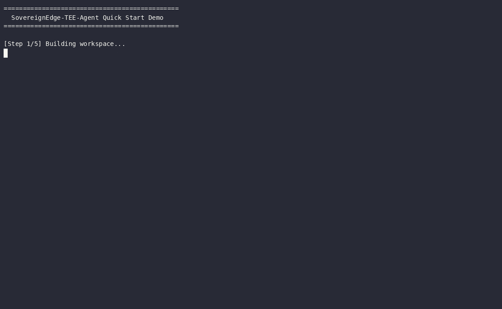

# SovereignEdge-TEE-Agent

A Hardware-Secured, Post-Quantum Edge Agent Infrastructure with Zero-Copy Remote Offloading.

## Overview

SovereignEdge-TEE-Agent implements a complete edge-to-cloud pipeline featuring:

- **AF_XDP/eBPF kernel-bypass ingestion** for line-rate telemetry processing
- **Hybrid Post-Quantum cryptography** (X25519 + ML-KEM-768) resistant to harvest-now-decrypt-later attacks
- **Graceful degradation** with automatic edge/cloud failover
- **Trusted Execution Environment (TEE)** gateway for confidential Qwen Cloud integration
- **Zero-Knowledge proofs** for verifiable safety policy compliance

## Architecture

```
┌─────────────────────────────────────────────────────────────────────────────┐
│                              EDGE NODE                                       │
│  ┌──────────────────┐    ┌──────────────────┐    ┌─────────────────────┐   │
│  │  AF_XDP Ingest   │───▶│  PQC Transport   │───▶│  Edge Agent         │   │
│  │  (eBPF/XDP)      │    │  (X25519+MLKEM)  │    │  (Local Inference)  │   │
│  └──────────────────┘    └──────────────────┘    └─────────────────────┘   │
│                                                              │              │
│                            Network Quality Monitor           │              │
│                            Online/Degraded/Offline Modes     │              │
└──────────────────────────────────────────────────────────────│──────────────┘
                                                               │
                              Encrypted UDP (Port 47821)       │
                                                               ▼
┌─────────────────────────────────────────────────────────────────────────────┐
│                         ALIBABA CLOUD TEE                                    │
│  ┌──────────────────┐    ┌──────────────────┐    ┌─────────────────────┐   │
│  │  TEE Gateway     │───▶│  Qwen Cloud API  │───▶│  ZK Proof Generator │   │
│  │  (Sealed Storage)│    │  (qwen-max)      │    │  (Policy Verification)│  │
│  └──────────────────┘    └──────────────────┘    └─────────────────────┘   │
│                                                                      │      │
└──────────────────────────────────────────────────────────────────────│──────┘
                                                                       │
                                                        Verifiable Execution Log
                                                                       ▼
                                                                Downstream Observers
```

## Project Structure

```
sovereign-edge-tee-agent/
├── crates/
│   ├── common/              # Shared types: frames, network quality, context buffer
│   ├── helpers/             # Time, builders, fixtures, metrics utilities
│   ├── xdp-ingest/          # Phase 1: AF_XDP daemon (bpf/xdp_prog.c = eBPF program)
│   ├── pqc-transport/       # Phase 1: X25519 + ML-KEM-768 hybrid KEX, AES-256-GCM
│   ├── edge-agent/          # Phase 2: mode state machine, hardware detection,
│   │                        #          llama.cpp local inference (feature "llama")
│   ├── tee-gateway/         # Phase 3: sealed storage + Qwen API relay
│   └── zk-proofs/           # Phase 4: policy constraints & execution logs
├── verification/            # Lean 4 machine-checked proofs of core invariants
├── configs/                 # Configuration files
├── evidence/                # Alibaba Cloud deployment runbook (planned deployment)
├── docs/                    # Documentation
├── scripts/                 # Build and demo scripts
└── tests/                   # Integration tests
```

## Demo



Real recorded run of [`scripts/demo.sh`](scripts/demo.sh) (asciinema source:
[`docs/demo.cast`](docs/demo.cast), full text in
[`docs/DEMO_TRANSCRIPT.md`](docs/DEMO_TRANSCRIPT.md)). To re-record:

```bash
DEMO_PAUSE=2.5 MODEL_GGUF=path/to/model.gguf \
  asciinema rec --idle-time-limit 3 -c "bash scripts/demo.sh" docs/demo.cast
agg --cols 130 --rows 34 --font-size 14 --theme dracula docs/demo.cast docs/demo.gif
```

## Quick Start

### Prerequisites

- Linux kernel 5.4+ with eBPF support
- Rust 1.70+ with nightly toolchain
- libbpf or aya for eBPF development
- Alibaba Cloud account with TEE-enabled VM

### Building

```bash
# Clone the repository
git clone https://github.com/rwilliamspbg-ops/SovereignEdge-TEE-Agent.git
cd SovereignEdge-TEE-Agent

# Build eBPF programs
clang -O2 -target bpf -c crates/xdp-ingest/bpf/xdp_prog.c -o xdp_prog.o

# Build Rust components
cargo build --release
```

### Running the Edge Agent

```bash
# Start AF_XDP ingestion daemon
sudo ./target/release/af_xdp_daemon --iface eth0 --port 47821

# Configure edge agent mode
export AGENT_MODE=online  # or 'degraded' or 'offline'
```

### Hardware Detection & Local Inference

The edge agent detects local GPUs (via DRM sysfs / NVIDIA proc) and NPUs
(via the Linux `accel` subsystem: AMD XDNA/Ryzen AI, Intel NPU, Qualcomm,
plus Rockchip and Hailo device nodes) at startup and logs what it finds.

Real local inference with llama.cpp is available behind the `llama` feature
(requires cmake and a C++ toolchain):

```bash
# Build with llama.cpp support
cargo build -p edge-agent --features llama

# Run offline with a GGUF model; --gpu-layers offloads to a detected GPU
# (GPU offload requires a CUDA/Vulkan-enabled llama.cpp build)
RUST_LOG=info ./target/debug/edge_agent --mode offline \
    --model path/to/model.gguf --gpu-layers 0
```

Without `--model` (or without the feature), the agent falls back to the
simulated inference backend.

### Deploying TEE Gateway on Alibaba Cloud

Deployment has **not been performed yet**. A step-by-step runbook — VM
provisioning, TEE setup, security-group rules, sealing, and the evidence to
capture — is maintained in `evidence/alibaba_cloud_setup.md`.

## Machine-Verified Invariants (Lean 4)

Core invariants are formally proved in the [`verification/`](verification/)
Lean 4 package (28 theorems, zero `sorry`; standard axioms only):

- **Mode state machine** — offline thresholds nest inside degraded ones;
  `determine_mode` is exactly characterized and monotone (a worse network
  never yields a less severe mode).
- **Context buffer** — byte and frame caps hold after every `push`, with
  machine-checked counterexamples showing the two necessary preconditions.
- **AES-GCM nonces** — no (key, nonce) reuse within a session; the counter
  hard-stops at 2^64 instead of wrapping.
- **Policy evaluator** — sound and complete against declarative semantics
  on well-formed input; short-circuit error masking is documented as proved
  behavior.

Rust doc comments on the modeled functions cite the theorem names. Build
with `cd verification && lake build`. See `verification/README.md` for the
full inventory and findings.

## Phases

Legend: ✅ implemented & tested · 🧪 simulated (real interface, mock backend) · 🔄 planned

### Phase 1: High-Performance Transport & Core Ingestion
- ✅ eBPF XDP program for kernel-bypass packet filtering (`bpf/xdp_prog.c`; not yet loaded by the daemon)
- 🧪 AF_XDP socket binding — daemon runs with simulated packet reception
- 🧪 Hybrid PQC key exchange — X25519 half is real (`x25519-dalek`); ML-KEM-768 is a placeholder pending `pqcrypto`/liboqs
- ✅ AES-256-GCM encrypted data frames with verified nonce discipline

### Phase 2: Edge Intelligence & Orchestration
- ✅ Local inference engine — real GGUF models via llama.cpp (`--features llama`), simulated fallback
- ✅ GPU/NPU hardware detection with live temperature/power sensors
- ✅ Rolling context buffer for situational awareness (bounds machine-verified)
- 🧪 Network quality monitoring — probe loop present, RTT measurement simulated
- ✅ Automatic online/degraded/offline mode transitions (machine-verified)

### Phase 3: Confidential Cloud Backend
- 🧪 TEE gateway with sealed storage — sealing/attestation flow simulated pending real SGX/SEV
- 🧪 Qwen Cloud API integration — request/response types real, HTTP call mocked
- ✅ Structured prompt management
- ✅ Session caching and statistics

### Phase 4: Verification & ZK-Proofs
- ✅ Safety policy constraint system (evaluator machine-verified)
- 🧪 ZK-SNARK proof generation — constraint checking real, proofs are SHA-256 commitments pending arkworks/groth16
- ✅ Execution trace logging
- ✅ Verifiable output export

### Phase 5: Submission & Demo Polish
- ✅ Repository cleanup and documentation (dead `src/` tree removed, truthful status labels)
- ✅ Formal verification package (`verification/`)
- ✅ Architecture diagrams (`docs/ARCHITECTURE.md`)
- ✅ Scripted demo with captured transcript (`scripts/demo.sh`, `docs/DEMO_TRANSCRIPT.md`)
- ✅ Demo recording — terminal capture in `docs/demo.gif` / `docs/demo.cast` (narrated screen video optional)
- 🔄 Alibaba Cloud deployment + captured evidence (runbook ready in `evidence/`)

## Configuration

### Edge Agent Settings

| Parameter | Default | Description |
|-----------|---------|-------------|
| `EDGE_TELEMETRY_UDP_PORT` | 47821 | UDP port for telemetry frames |
| `PROBE_INTERVAL_SECS` | 5 | Network quality probe interval |
| `SESSION_TIMEOUT_SECS` | 300 | PQC session timeout |
| `MAX_CONTEXT_FRAMES` | 100 | Maximum buffered frames |
| `LATENCY_THRESHOLD_MS` | 200 | Degraded mode trigger |

### TEE Gateway Settings

| Parameter | Default | Description |
|-----------|---------|-------------|
| `QWEN_API_ENDPOINT` | https://dashscope.aliyuncs.com | Qwen Cloud API URL |
| `SEALED_STORAGE_PATH` | /var/lib/tee/sealed | Sealed token storage |
| `ATTESTATION_PROVIDER` | alibaba-cas | Remote attestation service |

## Security Considerations

> **Prototype status**: the properties below describe the target design.
> Today the X25519 half of the KEX, AES-256-GCM framing, and the nonce
> discipline are real (the latter machine-verified); ML-KEM, TEE sealing/
> attestation, and ZK proof generation are simulated placeholders. Do not
> rely on this code for confidentiality yet.

1. **Post-Quantum Security** (target): control messages use hybrid X25519 + ML-KEM-768 key exchange
2. **TEE Isolation** (target): Qwen API tokens sealed within the enclave, never exposed to the host
3. **Zero-Knowledge Verification** (target): agent actions cryptographically proven to satisfy safety policies
4. **Harvest-Now-Decrypt-Later Resistance** (target): ephemeral symmetric keys derived from hybrid KEX

## License

MIT License - See [LICENSE](LICENSE) file for details.

## References

- [Alibaba Cloud TEE Documentation](https://www.alibabacloud.com/help/en/confidential-computing)
- [Qwen Cloud API Reference](https://help.aliyun.com/zh/dashscope)
- [eBPF and XDP Documentation](https://ebpf.io/)
- [ML-KEM-768 (Kyber) Specification](https://csrc.nist.gov/projects/post-quantum-cryptography)

## Contributing

Contributions welcome! Please read our contributing guidelines before submitting PRs.

---

*Built for the Global AI Hackathon Series with Qwen Cloud*
