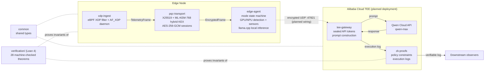
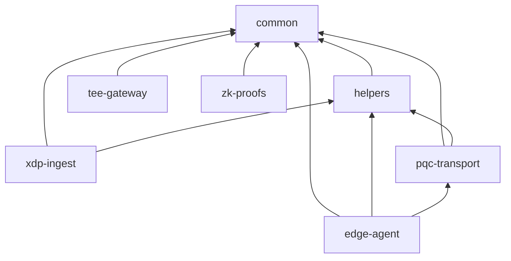
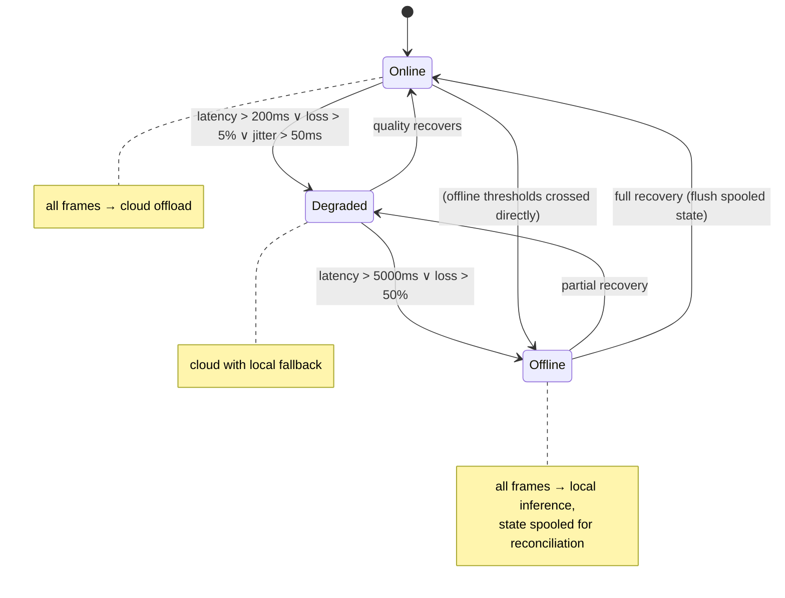
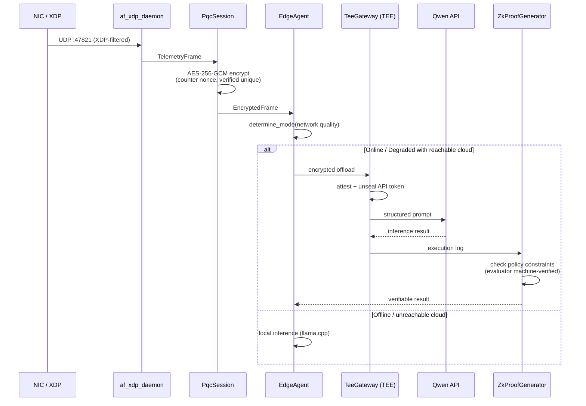

# Architecture

## Component Overview

Status legend: **solid** = implemented & tested, **dashed** = simulated
placeholder (real interface, mock backend).

## Crate Dependency Graph

`edge-agent` optionally links llama.cpp behind the `llama` cargo feature.

## Graceful Degradation State Machine

Machine-verified in `verification/SovereignEdge/ModeMachine.lean`:
the offline thresholds nest inside the degraded ones
(`offline_implies_degraded`), the transitions below are exactly
`determine_mode` (`determineMode_*_iff`), and a worse network can never
produce a less severe mode (`determineMode_monotone`).

## Frame Processing Sequence (target end-to-end path)

**Current wiring status**: each stage works in isolation (unit tests, demo
binaries); the cross-stage arrows marked "planned" in the overview are not
yet connected in code — see `tests/integration/` for the closest
end-to-end exercise, and the Phases section of the README for what is
simulated.
